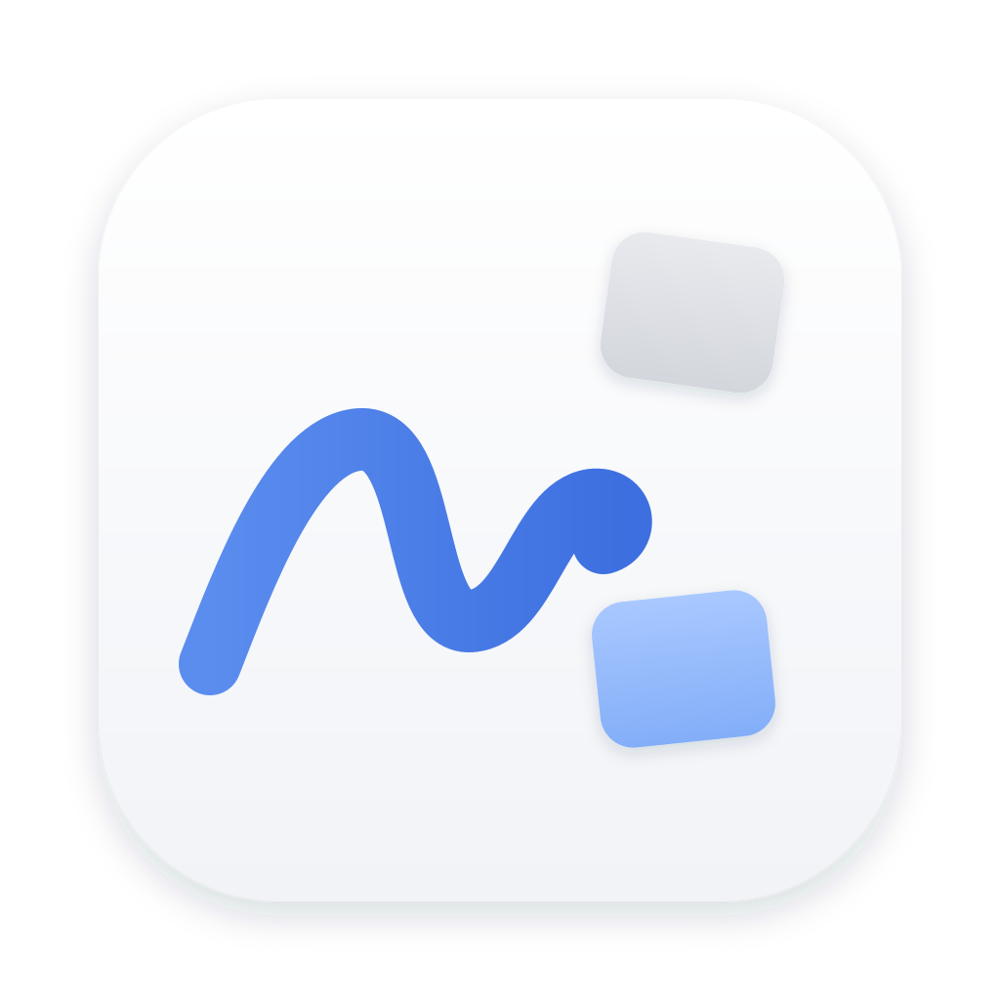
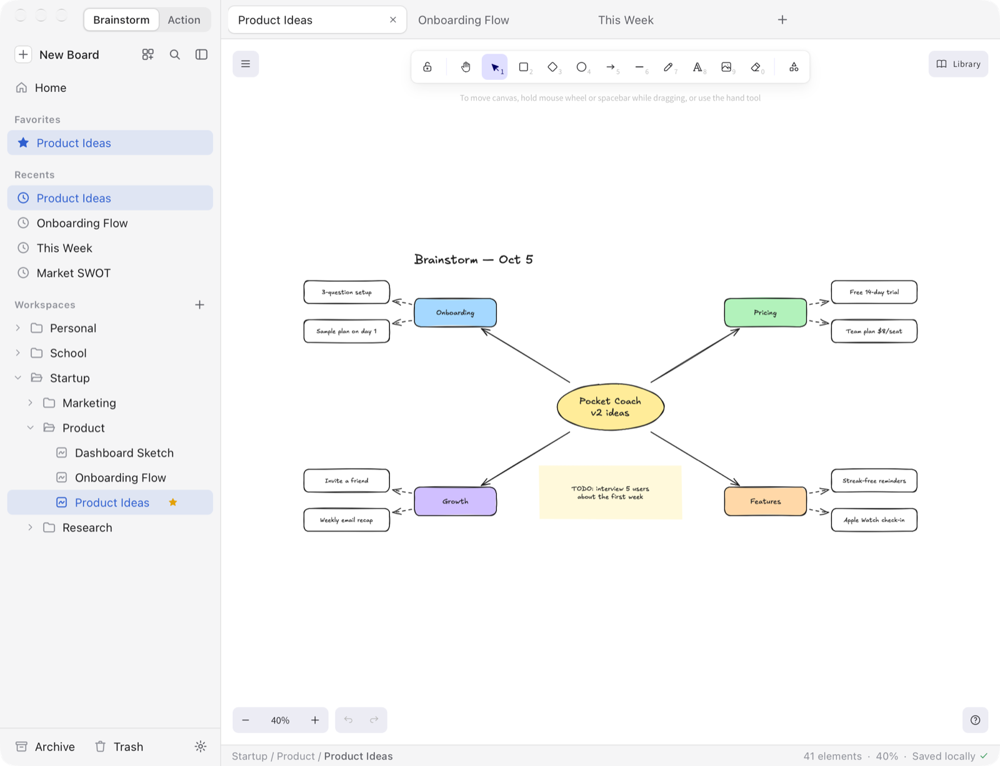
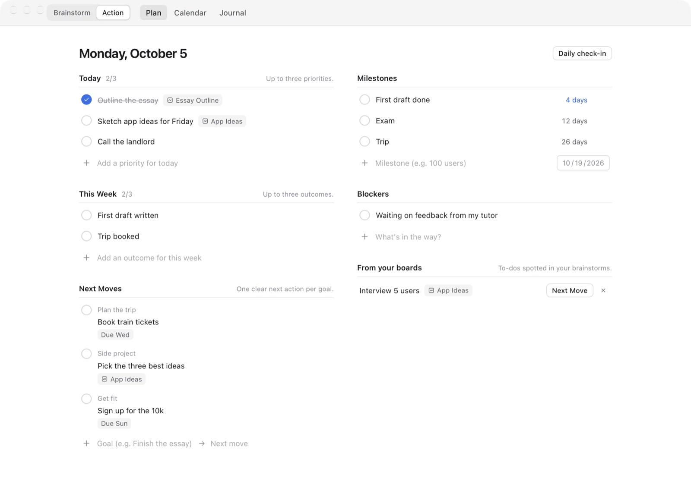
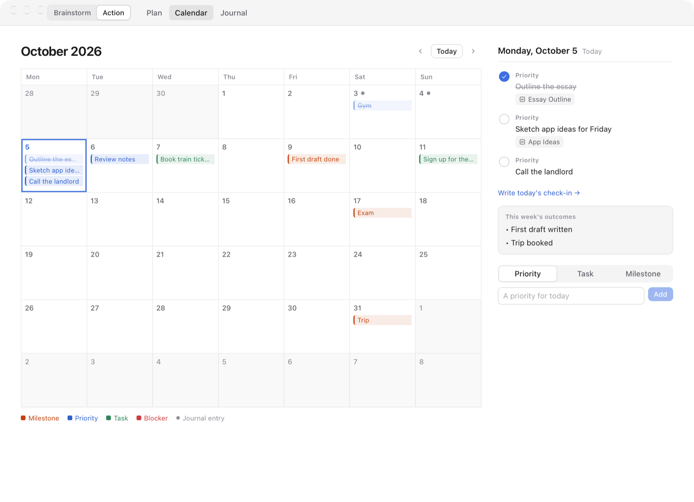

<p align="center">
  
</p>

<h1 align="center">Whiteboard</h1>

<p align="center">
  A calm macOS home for your <a href="https://excalidraw.com">Excalidraw</a> boards.<br />
  Brainstorm freely, then plan what to do next. Local-first, no accounts.
</p>



## Features

- **The real Excalidraw editor.** It uses the official `@excalidraw/excalidraw`
  package, unmodified, with the same tools, shortcuts, libraries and file format.
- **Your boards, organized.** Workspaces and folders (ordinary Finder
  folders), tabs, favorites, recents, archive, trash, thumbnails, and ⌘K search
  that also looks inside boards.
- **Never lose work.** Atomic autosave, local version history, and conflict
  detection when a file changes outside the app.
- **Visual references.** Paste a YouTube, Instagram or web link to get a
  preview card. Press ⇧⌘2 to drop a screenshot straight onto the board.
- **Action.** A separate, deliberately small planning view: today's 3
  priorities, the week's outcomes, next moves, milestones, blockers, a
  calendar of everything with a date, a daily check-in, and a Journal.
  Selections on a board can be sent to Action, with a link back.
- **Local and private.** Works offline. No accounts, cloud, analytics or AI by
  default.

| Action — Plan                               | Action — Calendar                          |
| ------------------------------------------- | ------------------------------------------ |
|  |  |

## Install

Download `Whiteboard_*_aarch64.dmg` from
[Releases](../../releases) (Apple Silicon), open it, and drag Whiteboard to
Applications. Builds are not notarized. On first launch, right-click
Whiteboard.app → **Open** (or run
`xattr -dr com.apple.quarantine /Applications/Whiteboard.app`).

You can also build it yourself; see [Build](#build).

## Brainstorm and Action

Whiteboard has two separate sides, switched with the **Brainstorm | Action**
control at the top-left (⇧⌘A):

- **Brainstorm** is the Excalidraw workspace, unchanged. There's no task UI on
  the canvas.
- **Action** is a plain execution view:
  - **Today**: up to 3 priorities. Unfinished ones from earlier days wait
    under "Unfinished from earlier" until you move them to today.
  - **This Week**: up to 3 outcomes.
  - **Next Moves**: goal → one next action. When you finish a move, Whiteboard
    asks for the goal's next one, or you can mark the goal done.
  - **Milestones**: a date with a countdown ("First draft — 9 days").
  - **Blockers**.
  - **Daily check-in**: three optional questions. After 6 PM (configurable)
    it's a quiet nudge in Action, never a popup.
  - **Calendar**: a month view of priorities planned for each day,
    milestones, tasks with due dates, blockers, what you finished, and
    journal entries. Click a day to see it in full or plan it.
  - **Journal**: check-ins and finished items in date order, grouped by week
    with a one-line summary.

**Brainstorm → Action**: select shapes, text or groups, then right-click →
_Send to Action…_ (added to Excalidraw's own menu), ⌥⌘A, or ⌘K → _Make
Priority / Next Move / Milestone / Blocker_. The item keeps a link to the
board _and the exact shapes_.

**Action → Brainstorm**: click an item's board chip to open the board with
those shapes selected and centered. Any item can be linked to a board from
its ⋯ menu; the picker suggests related boards.

**Suggestions** (never applied without a click):

- On Home, under "Tidy up": cleaner names for messy boards
  (`Untitled Whiteboard 7` → `Onboarding Flow`) and folder moves for loose
  boards.
- In Action, under "From your boards": to-dos found in your boards (`TODO:`,
  `Next:`, `[ ]`, `☐`).
- Related boards in the board picker, and weekly summaries in the Journal.

These are simple local rules over your boards' text. In Settings → Action you
can optionally use a model running on this Mac via Ollama
(`127.0.0.1:11434`) for board names and weekly summaries. It's off by default,
and nothing leaves your computer.

Action data lives in `…/com.local.whiteboard/action.json` (plus `.bak`) and
is never written into `.excalidraw` files.

## Visual references and screenshots

- **Paste a link** onto the canvas (⌘V), drop one from a browser, or use
  ⌘K → _Insert Web Reference_ / `/embed <url>`. YouTube, Instagram and other
  websites become a compact card made of ordinary Excalidraw elements
  (rounded rectangle, thumbnail image, text), grouped together. Cards save in
  the `.excalidraw` file and appear in PNG/SVG exports. Each element stores
  `customData.wbRef = { cardId, url, kind, role }` (Excalidraw's official
  metadata field), and the card's rectangle has a standard Excalidraw `link`,
  so the link still works in plain Excalidraw.
- **Links in your own text are clickable.** Any text or shape label that
  contains a URL (`https://…` or `www.…`) gets a standard Excalidraw link
  automatically. ⌘-click any linked shape or text to open it.
- **Open a card** by double-clicking it or clicking Excalidraw's link icon.
  Clicking or dragging never opens it. Right-click a card for Open Link, Copy
  URL, Refresh Preview, Duplicate, Remove Preview, Convert to Plain Link and
  Delete.
- **Screenshots**: ⇧⌘2 (works system-wide; you can turn that off in Settings →
  Capture), ⌘K → _Capture Screenshot / Window / Full Screen_, or `/shot`.
  This uses macOS's own selection UI: drag a region, press Space for window
  mode, or Esc to cancel. The image is inserted into the active board as a
  normal Excalidraw image and stored inside the board file. The temp file is
  deleted at once, and nothing is saved to the Desktop. macOS requires the
  **Screen Recording** permission for this. Whiteboard asks once and then
  links to System Settings. Unsigned local builds may need the permission
  granted again after a rebuild.
- **Clipboard images**: ⌘V works as in Excalidraw (also when the pointer isn't
  over the canvas). ⌘K → _Insert Image from Clipboard_ (or `/paste`) reads the
  macOS clipboard directly.

### Remote requests (privacy)

Whiteboard makes network requests **only when you insert or refresh a link**:

| Link           | Requests                                                                                                                                                                                                                                        |
| -------------- | ----------------------------------------------------------------------------------------------------------------------------------------------------------------------------------------------------------------------------------------------- |
| YouTube        | `youtube.com/oembed` (YouTube's documented public endpoint: title and channel) and the video thumbnail from `i.ytimg.com`                                                                                                                       |
| Instagram      | one GET of the post page. Instagram serves no preview tags to plain requests, so the page is then loaded once in a hidden, invisible web view to read its image and caption (no login, no tokens). If that fails you get a clean fallback card. |
| Any other site | one GET of the page (title / Open Graph tags), its preview image, and its favicon                                                                                                                                                               |

If a site can't be resolved, a DNS lookup of `apple.com` (no HTTP request)
distinguishes "offline" from "site unreachable". Board contents are never
sent anywhere, and there are no analytics. Previews are cached in
`…/com.local.whiteboard/link-cache/`, and the thumbnail is embedded in the
board, so existing cards look the same offline. A link pasted while offline
becomes a basic card ("Preview unavailable offline") with no retries.

## Architecture

```
Tauri 2 (Rust)                         Web frontend (React 19 + TypeScript + Vite)
├─ files.rs     atomic writes,         ├─ editor/      one <Excalidraw/> per open tab + BoardSession
│               folder tree, moves,    │               (autosave, conflicts, history, thumbnails)
│               conflict detection     ├─ shell/       sidebar, tabs, status bar, palette, dialogs
├─ appdata.rs   history, thumbnails,   ├─ lib/         board operations, commands/shortcuts,
│               trash, app paths       │               templates, exports, library, lifecycle
├─ search.rs    text index over boards ├─ state/       zustand store + state.json persistence
├─ webref.rs    link previews + cache  ├─ platform/    IPC wrappers + native file pickers
│                                      └─ action/      Action view, calendar, suggestions, Journal
├─ capture.rs   screenshots, clipboard image, ⇧⌘2
└─ menu.rs      native macOS menu bar
```

- **Rust** owns every disk write. Board writes are atomic (temp file → fsync →
  rename), refuse non-Excalidraw content, and refuse to overwrite a file whose
  modification time changed since Whiteboard last read it (`CONFLICT`).
- **Each open tab keeps its own live Excalidraw instance**, so switching is
  instant and undo history is per board. Inactive editors are hidden and
  `inert`. Restored tabs mount lazily on first activation.
- The shell's React state (zustand) never holds canvas data; Excalidraw's
  `onChange` only touches plain fields in `BoardSession`, so drawing performance
  is unaffected.

## How Excalidraw is integrated

- Uses the official `@excalidraw/excalidraw` **0.18.1** npm package, unmodified
  (no fork). The toolbar, menus, shortcuts, libraries, export dialog, themes,
  fonts and file format are Excalidraw's own.
- **Fonts**: `scripts/copy-excalidraw-assets.mjs` copies the package's font
  files into `public/fonts`, and `window.EXCALIDRAW_ASSET_PATH` points at the
  app bundle, so fonts work fully offline.
- **Native file dialogs for Excalidraw's own features**: Excalidraw does its
  file I/O through `browser-fs-access`, which uses the File System Access API
  when present. `src/platform/nativeFilePickers.ts` provides
  `showOpenFilePicker` / `showSaveFilePicker` backed by native macOS dialogs and
  Rust file commands. Insert image, export PNG/SVG, and library import/export
  therefore work natively without changing Excalidraw.
- `UIOptions` disables only Excalidraw's browser-specific file actions (Open,
  Save to file, Export JSON). The main menu gets native **Open… / Save As… /
  Version History** in their place.
- Boards are saved with Excalidraw's `serializeAsJSON(..., "local")` and loaded
  with its `restore()`. Whiteboard writes nothing extra into `.excalidraw`
  files.
- Drag and drop: Excalidraw handles image, SVG and library drops itself.
  Whiteboard only intercepts dropped `.excalidraw` files so they open as tabs
  instead of replacing the current board. The web view can't see a dropped
  file's path, so a small Rust locator (`locate_file`: name, size and mtime,
  then Spotlight) finds the original. If it can't, a copy is imported.
- **Shortcut conflict**: Excalidraw uses ⌘K for "add link". Whiteboard uses ⌘K
  for search, so "Add Link to Selection" is available from the ⌘K palette (and
  from Excalidraw's element toolbar).

## Where data lives

| What                                                                                | Location                                                                                      |
| ----------------------------------------------------------------------------------- | --------------------------------------------------------------------------------------------- |
| Boards and workspaces                                                               | `~/Documents/Whiteboard/` (ordinary folders and `.excalidraw` files; changeable in Settings)  |
| App metadata and session (favorites, recents, archive list, tabs, viewports, prefs) | `~/Library/Application Support/com.local.whiteboard/state.json` (+ `.bak`)                    |
| Version history                                                                     | `…/com.local.whiteboard/history/<path-hash>/<epoch-ms>.excalidraw`                            |
| Thumbnails                                                                          | `…/com.local.whiteboard/thumbs/<path-hash>.png`                                               |
| Trash                                                                               | `…/com.local.whiteboard/trash/<id>/` (only "Delete Permanently" / "Empty Trash" remove files) |
| Personal library                                                                    | `…/com.local.whiteboard/library.excalidrawlib`                                                |
| Your templates                                                                      | `…/com.local.whiteboard/templates/*.excalidraw`                                               |
| Link preview cache                                                                  | `…/com.local.whiteboard/link-cache/*.json`                                                    |
| Action items, check-ins, dismissed suggestions                                      | `…/com.local.whiteboard/action.json`                                                          |
| Window size and position                                                            | managed by `tauri-plugin-window-state`                                                        |

Archive is metadata only: archived boards stay where they are on disk and are
hidden from the workspace tree. If you rename or move boards inside Whiteboard,
favorites, history and thumbnails follow them. If you rename or move them in
Finder, the boards still show up in the tree, but their favorite/archive flags
are dropped.

History: a snapshot every 10 minutes while you edit (configurable), on every ⌘S,
before the first edit of each session, and before any restore, reload or
conflict overwrite. Snapshots are thinned out to one per hour after 2 hours and
one per day after a day, kept for 60 days, with at most 80 per board.

## Development

Requirements: Node 20+, Rust (stable), Xcode Command Line Tools.

```bash
npm install
npm run app:dev        # run the desktop app with hot reload
npm run dev            # UI only, in a browser, against an in-memory dev backend
npm run typecheck
cd src-tauri && cargo test
```

`npm run dev` in a plain browser automatically uses `src/dev/mockBackend.ts`
(dev builds only), which imitates the Rust commands with an in-memory
filesystem stored in `localStorage`. It's handy for UI work.

## Build

```bash
npm run app:build
```

Output:

- `src-tauri/target/release/bundle/macos/Whiteboard.app`
- `src-tauri/target/release/bundle/dmg/Whiteboard_1.0.0_aarch64.dmg`

The build is unsigned. To open it the first time: right-click
`Whiteboard.app` → Open. You can also run
`xattr -dr com.apple.quarantine Whiteboard.app`.

`.excalidraw` files are registered with the "Alternate" rank. To make
Whiteboard the default app: Finder → Get Info on any `.excalidraw` file → Open
with: Whiteboard → Change All….

## Keyboard shortcuts

| Action                                    | Shortcut                                                    |
| ----------------------------------------- | ----------------------------------------------------------- |
| New board                                 | ⌘N or ⌘T                                                    |
| New board from template                   | ⌥⌘N                                                         |
| New folder                                | ⇧⌘N                                                         |
| Open file                                 | ⌘O                                                          |
| Save now (+ history snapshot)             | ⌘S                                                          |
| Save As                                   | ⇧⌘S                                                         |
| Close board / reopen closed board         | ⌘W / ⇧⌘T                                                    |
| Search boards & commands                  | ⌘K                                                          |
| Switch tabs                               | ⌘1 … ⌘9, ⌃⇥ / ⌃⇧⇥                                           |
| Toggle sidebar                            | ⌘\                                                          |
| Focus mode                                | ⇧⌘F (Esc exits)                                             |
| Version history                           | ⌘Y                                                          |
| Quick Look selected board (sidebar/cards) | Space                                                       |
| Settings                                  | ⌘,                                                          |
| Shortcut list                             | ⌘/                                                          |
| Export image options (Excalidraw)         | ⇧⌘E                                                         |
| Capture screenshot onto the board         | ⇧⌘2 (system-wide)                                           |
| Switch Brainstorm / Action                | ⇧⌘A                                                         |
| Send selection to Action                  | ⌥⌘A                                                         |
| Slash commands on the canvas              | `/` then `shot`, `embed <url>`, `window`, `screen`, `paste` |
| Open a link card                          | double-click                                                |

All other Excalidraw shortcuts work as usual. Press `?` on the canvas for
Excalidraw's full list.

## Licensing

Whiteboard is released under the [MIT License](LICENSE). It is an
independent project, not affiliated with or endorsed by Excalidraw.

Excalidraw is MIT-licensed (© 2020 Excalidraw). The bundled fonts are under
the SIL Open Font License 1.1, except Comic Shanns, which is MIT. Full texts and
attributions are in [`LICENSES/`](LICENSES/README.md) and inside the app under
Settings → About → Licenses. The Whiteboard icon is original artwork and does
not use the Excalidraw logo.
